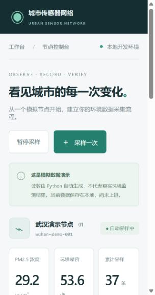

# 城市传感器网络 · BOT Chain Demo

在线 Demo：<https://city-sensor-network-demo.vercel.app/>

一个面向环保数据可信采集的黑客松 Demo：模拟城市空气质量和噪音采样，将读数定时封装为数据批次，对批次文件计算 SHA-256 指纹，并将指纹提交到 BOT Chain 测试网。订阅者可按链上订阅状态获取完整数据文件，并独立校验文件是否在存证后被修改。

> **演示范围：** 当前读数由 Python 模拟生成，没有连接真实传感器。这个 Demo 展示数据打包、链上存证、钱包订阅和文件校验的产品流程，不代表已完成真实设备接入、硬件防作弊或城市级节点铺设。



## BOT Chain 主网部署

项目已在 BOT Chain 主网完成 `SensorDataMarket` 合约部署：

- Chain ID：`677`
- RPC：<https://rpc.botchain.ai>
- 原生代币：`BOT`
- 合约地址：`0xC55793411e9fC98288bA09976D607cEAf94650bB`
- 部署交易哈希：`0x6bf8fb17bd0d08dcd425f445bc5d23a520e6555b77f00bd4c0d9c9c89007051e`

## Demo 流程

1. 后端每 5 秒生成一条模拟 PM2.5 和噪音数据，并保存到本地 SQLite。
2. 每分钟把新增读数封装成不可变 JSON 批次，计算文件原始字节的 SHA-256。
3. 在工作台连接 MetaMask 测试网钱包，由存证账户提交批次哈希。
4. 后端读取链上交易回执，核对合约、数据流、文件名和文件哈希。
5. 数据购买者在订阅页查看价格并通过钱包购买订阅；后端按实时链上权限限制完整数据下载。
6. 验证页重新计算所选批次文件的指纹，并对照已核验的链上交易事件。

哈希校验只能证明文件与存证时一致，不能单独证明现实传感器的读数准确。

## 本地运行

需要 Python 3.11 或更高版本。Windows PowerShell：

```powershell
git clone https://github.com/WsyZpc/city-sensor-network-demo.git
cd city-sensor-network-demo
python -m venv .venv
.\.venv\Scripts\python.exe -m pip install --upgrade pip
.\.venv\Scripts\python.exe -m pip install -r requirements.txt
.\.venv\Scripts\python.exe app.py
```

打开 <http://127.0.0.1:8000>。保持终端运行，按 `Ctrl+C` 停止服务。

macOS / Linux：

```bash
git clone https://github.com/WsyZpc/city-sensor-network-demo.git
cd city-sensor-network-demo
python3 -m venv .venv
.venv/bin/python -m pip install --upgrade pip
.venv/bin/python -m pip install -r requirements.txt
.venv/bin/python app.py
```

如果 8000 端口已被占用，Windows PowerShell 可运行 `$env:SENSOR_PORT = '8001'`，macOS / Linux 可运行 `export SENSOR_PORT=8001`，然后重新启动并访问 `http://127.0.0.1:8001`。

## 钱包与测试网

- 钱包：使用支持 EVM 的 MetaMask，并切换到 BOT Chain Testnet。
- Chain ID：`968`（十六进制 `0x3c8`）。
- RPC：`https://rpc.bohr.life`。
- 原生代币：`BOT`。测试网代币仅用于测试。
- 浏览器：<https://test.bohrchain.com>。
- 合约地址：`0xC55793411e9fC98288bA09976D607cEAf94650bB`。
- 数据流：`0`（Air Quality Wuhan；当前合约显示价格为 `0.0025 BOT/天`）。
- 前端 ABI 与网络配置：[`templates/static/abi.json`](templates/static/abi.json)、[`templates/static/chain-config.json`](templates/static/chain-config.json)。

连接钱包时，Demo 会请求一次签名以证明钱包归属。该登录签名不发起交易、不支付 Gas。购买订阅或提交批次存证时会弹出单独的链上交易确认，由你在 MetaMask 中审核并确认。

**合约源码说明：** `contracts/DataAttestation.sol` 是项目早期的存证合约草稿，不是上面已部署的 `SensorDataMarket` 合约源码。运行时按 `templates/static/abi.json` 与现有测试网合约交互；不要把草稿误认为已部署合约的可复现源码。

## 页面

- `/`：模拟数据工作台、批次列表与存证入口。
- `/subscribe`：连接钱包、查看订阅状态并购买数据订阅。
- `/verify`：上传批次 JSON，核对 SHA-256 与链上回执。
- `/docs`：FastAPI 接口文档。

## 项目结构

| 文件或目录 | 用途 |
| --- | --- |
| `app.py` | FastAPI 服务、模拟采样调度、钱包会话、链上权限与下载接口 |
| `simulator.py` | 生成演示用空气质量和噪音数据 |
| `storage.py` | SQLite 读数存储 |
| `batches.py` | JSON 批次封装、文件哈希和存证元数据 |
| `chain.py` | BOT Chain JSON-RPC 读取与交易回执校验 |
| `wallet_auth.py` | EIP-191 钱包签名验证和本地演示会话 |
| `templates/monitor.html` | 工作台页面 |
| `templates/subscribe.html` | 订阅页面 |
| `templates/verify.html` | 文件校验页面 |
| `templates/static/` | 前端脚本、样式、ABI、网络配置和 ethers 浏览器库 |
| `data/` | 本机运行后生成的 SQLite 数据库和批次文件；不提交到 Git |

## 开发检查

```powershell
.\.venv\Scripts\python.exe -m unittest discover -s tests -v
```

测试使用临时目录，不读取你的演示数据库。

## Demo 限制与后续工作

- 所有读数都是模拟的，尚无真实硬件数据来源。
- 钱包会话保存在本地服务内存中，服务重启后需重新登录。
- BOT Chain 测试网合约是外部已部署合约；合约源码草稿与当前运行 ABI 不对应。
- 评审前仍应使用 MetaMask 实际完成一次批次存证和订阅购买，并记录相应交易与部署材料。
- 主网发布、传感器设备身份校验、质押防作弊、真实数据采购履约和长期节点运营均不包含在当前 Demo 中。
